# Curso sobre Linux (Netacad)

## Curso LINUX
* O que é o Linux?
    * Linux é um software de sistema operacional que é executado em um sistema de computador de hardware.

## GUI (Interface gráfica do usuário)
* Por trás dessa interface. está um código que um programador desenvolveu.
* Além de usar a GUI, os desktops Linux também utilizam outra interface mais eficiente, a interface de linha de comando (CLI).

## CLI
* Interface baseada em texto que aceita comandos digitados na tela
    * O que é um comando? Um comando é um programa de software que, quando executado na CLI (interface de linha de comando), executa uma ação no computador.
    * A interface baseada em comandos é muitas vezes um "herói" quando se trata de uma administração do sistema e solução de problemas
    * Ferramenta poderosa que frequentemente é o principal método usado para dispositivos de consumo de energia, servidores de computação em nuvem extremamente pequenas e capazes de tudo o que há entre eles

## Empresas e instituições que usam LINUX
* NASA 
* McDonald's
* New York Stock Exchange (NYSE)
* DreamWorks Animation
* Departamento de Defesa dos EUA

## Comandos LINUX
O nome do comando é geralmente associado ao que ele faz ou no que o desenvolvedor que criou o comando acha que descreve a melhor função do comando.
A maioria dos comandos segue um padrão simples de sintaxe `` comando [opcoes…] [argumentos…] ``, ou seja, se digita o comando e em seguida quaisquer opções e/ou argumentos antes de pressionar a tecla Enter. // Normalmente, as opções alteram o comportamento do comando e os argumentos são itens ou valores para o comando agir.

------------------------------------------------------------------------------
* `` ls `` - exibe uma lista de arquivos contidos no diretório atual
* aptitude - ferramenta de gerenciamento de pacotes disponível em algumas distribuições Linux (este comando aceitará `` moo `` como argumento)
* `` pwd `` - imprime o diretório de trabalho, sua localização atual dentro do sistema de arquivos
* `` cd `` - navega pela estrutura do sistema de arquivos
* `` su `` - permite que você atue temporariamente como um usuário diferente. Por padrão, se uma conta de usuário não for especificada, o comando su abrirá um novo shell como usuário root, que fornece privilégios administrativos
* `` sudo `` - o comando sudo permite que um usuário execute um comando como outro usuário sem criar um novo shell. Em vez disso, para executar um comando com privilégios administrativos, use-o como um argumento para o comando `` sudo ``. Como o comando `` su ``, o comando `` sudo `` assume por padrão que a conta de usuário root deve ser usada para executar comandos
* `` chmod `` - usado para alterar as permissões de um arquivo ou diretório. Somente o usuário root ou o usuário que possui o arquivo é capaz de alterar as permissões de um arquivo
* `` chown `` - usado para alterar a propriedade de arquivos e diretórios
* `` cat `` - usado para visualizar rapidamente o conteúdo de pequenos arquivos
* `` head `` - usado para filtrar a visualização de um arquivo para a parte superior dele
* `` tail `` - usado para filtrar a visualização de um arquivo para a parte inferior dele
* `` cp `` - usado para copiar arquivos
* `` dd `` - é um utilitário para copiar arquivos ou partições inteiras no nível de bits
* `` mv `` - usado para mover um arquivo de um local no sistema de arquivos para outro
* `` rm `` - usado para excluir arquivos e diretórios
* `` grep `` - é um filtro de texto que irá procurar linhas de entrada e retorno que contenham uma correspondência para um determinado padrão
* `` shutdown `` - faz com que o sistema seja desligado de forma segura
* `` date `` - usado para verificar a hora no terminal, seu padrão de saída é: `` dia_da_semana mês dia hora:minuto:segundo ano UTC ``
* `` ifconfig `` - usado para exibir informações sobre a configuração de rede
* `` iwconfig `` - semelhante ao comando `` ifconfig ``, mas é dedicado a interfaces de rede sem fio
* `` ping `` - usado para verificar a conectividade entre dois computadores
* `` ps `` - usado para listar processos
* `` apt-get `` - um programa front-end para a ferramenta `` dpkg ``, torna o gerenciamento de pacotes ainda mais fácil.
    * `` apt-get update `` - atualiza a lista de pacotes disponíveis
    * `` apt-cache search `` - procura palavras-chave dentro dos pacotes
    * `` apt-get install `` - usado para instalar o pacote desejado
    * `` apt-get update `` - atualiza o cache de todos os pacotes disponíveis
    * `` apt-get upgrade `` - atualiza todos os pacotes e dependências 
    * `` apt-get remove `` - remove um pacote
    * `` apt-get purge `` - limpa completamente um pacote do sistema

## Argumentos
Um argumento pode ser usado para especificar algo para o comando agir.
* O comando ``` ls ``` pode ser dado o nome de um diretório, ex.: ls Documents // o comando ` listará o conteúdo ` (ou lista de arquivos) do diretório Documents.

## Opções
Usadas para alterar o comportamento de um comando. Anteriormente, o comando ls foi usado para listar o conteúdo de um diretório.
No exemplo a seguir, a opção `` -l `` é fornecida ao comando ls, o que resulta em uma `` saída de “exibição longa” ``, o que significa que a saída fornece `` mais informações sobre cada um dos arquivos `` listados:

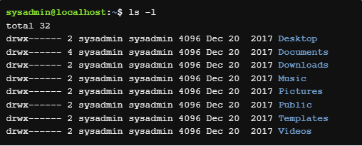

    Observe que, no comando acima, o -l é o "L" minúsculo.

Muitas vezes, o caractere é escolhido para ser mnemônico para o seu propósito, como escolher a letra `` l para longo `` ou `` r para reverso ``. Por padrão, o comando ls imprime os resultados em ordem alfabética, portanto, adicionar a opção -r irá imprimir os resultados em ordem alfabética inversa.
* As opções podem ser usadas de uma só vez, por exemplo `` ls -l -r `` ou `` ls -rl `` ou `` ls -lr ``. Todas as opções vão gerar o mesmo resultado.

## Diretórios
Os arquivos são usados para armazenar dados tais como texto, gráficos e programas. Os diretórios são um tipo de arquivo usado para armazenar outros arquivos.
Para descobrir onde você está atualmente localizado dentro do sistema de arquivos, o comando pwd pode ser usado. O comando pwd imprime o diretório de trabalho, sua localização atual dentro do sistema de arquivos:

    pwd [OPÇÕES]

A saída do comando acima indica que o usuário está atualmente em sua pasta pessoal, mostrada no sistema de arquivos abaixo:

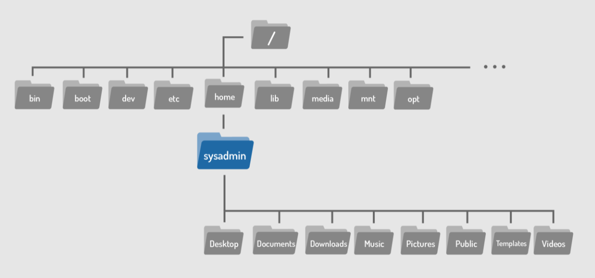

### Alterando diretórios
Os diretórios são um tipo de arquivo usado para armazenar outros arquivos, eles fornecem uma estrutura organizacional hierárquica, como na imagem abaixo:

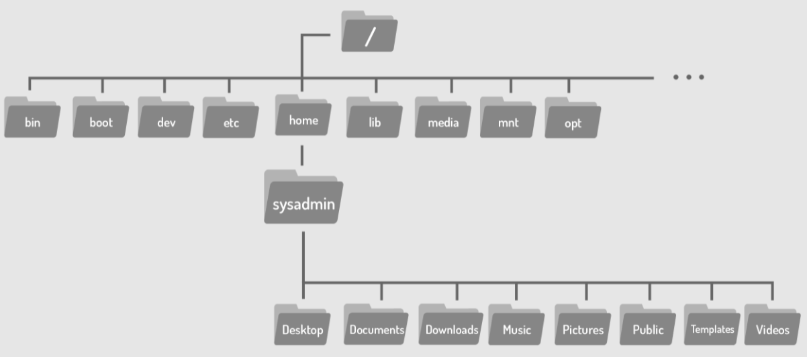

Para navegar pela estrutura do sistema de arquivos, use o comando `` cd `` (change directory) para alterar diretórios.

    cd [opções] [caminho]

Se você olhar novamente para o gráfico acima, você verá que o diretório Documents está localizado dentro do diretório home, onde você se encontra atualmente. Para mover para o diretório Documents, use-o como argumento para o comando `` cd ``:


Os diretórios são equivalentes a pastas no Windows e Mac OS. Assim como esses sistemas operacionais mais populares, uma estrutura de diretórios Linux tem um nível superior. Não é chamado de “Meu Computador”, mas sim o diretório root (raiz) e é representado pelo caractere "/". Para mover para o diretório root, use o caractere "/" como argumento para o comando `` cd ``.

O argumento para o comando cd é mais do que apenas o nome de um diretório, na verdade é um caminho. Um caminho é uma lista de diretórios separados pelo caractere "/". Por exemplo, `` /home/sysadmin `` é o caminho para seu diretório home.

------------------------------------------------------------------------------

Se você pensar no sistema de arquivos como um mapa, os caminhos são as direções passo a passo; eles podem ser usados para indicar a localização de qualquer arquivo dentro do sistema de arquivos. Existem dois tipos de caminhos: absoluto e relativo. Os caminhos absolutos começam na root do sistema de arquivos, os caminhos relativos começam a partir da sua localização atual.
* Caminho absoluto: um caminho absoluto permite que você especifique a localização exata de um diretório.
* Caminho relativo: um caminho relativo fornece direções para um arquivo relativo à sua localização atual no sistema de arquivos. Os caminhos relativos não começam com o caractere "/", eles começam com o nome de um diretório. Um caminho relativo começa a partir do diretório atual. Use o caractere / para separar os nomes dos diretórios e o resultado School/Art é um caminho relativo do diretório Documents para o diretório Art:

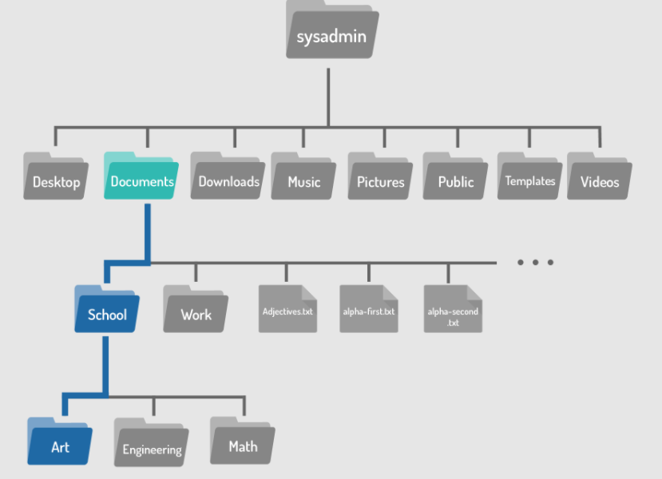

------------------------------------------------------------------------------
### Atalhos
* Os caracteres `` ".." ``: Independentemente do diretório em que você esteja, os caracteres ".." sempre representa um diretório maior em relação ao diretório atual, às vezes referido como o diretório pai. Mais resumidamente, os caracteres ".." são usados para voltar um diretório.
* O caractere `` "." ``: Independentemente do diretório em que você esteja, o caractere . sempre representa seu diretório atual. Para o cd este atalho não é muito útil, mas será útil para comandos cobertos nas seções subsequentes.
* O caractere `` "~" ``: Usado para retornar ao seu diretório home a qualquer momento, execute o seguinte comando: cd ~.

### Listando arquivos
Por padrão, quando o comando ls é usado sem opções ou argumentos, ele irá listar os arquivos no diretório atual.
Para saber os detalhes sobre um arquivo, tais como, o tipo de arquivo, as permissões, propriedade ou o carimbo de data/hora, execute uma listagem longa usando a opção `` -l `` para o comando ls. Abaixo, uma listagem do diretório /var/log é usada como um exemplo, uma vez que fornece uma variedade de saídas:


Cada linha corresponde a um arquivo contido no diretório. As informações podem ser divididas em campos separados por espaços. Os campos são os seguintes:

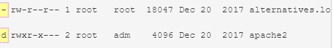

Na verdade, o primeiro campo contém dez caracteres, onde o primeiro caractere indica o tipo de arquivo e os próximos nove especificam permissões. Os tipos de arquivo são:

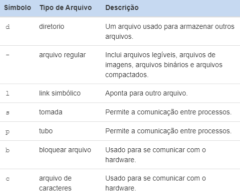

O primeiro arquivo alternatives.log é um arquivo regular -, enquanto o segundo arquivo apache2 é um diretório d.


## Acesso Administrativo
Existem muitos comandos Linux que lidam com informações confidenciais, como senhas, hardware do sistema, ou de outra forma operam sob outras circunstâncias excepcionais. Impedir que usuários regulares executem esses comandos ajuda a proteger o sistema. Fazer login como usuário root fornece acesso administrativo, permitindo a execução de alguns dos comandos privilegiados. 

### O Comando `` su ``

`` su [opções] [nome-do-usuário] ``

O comando `` su `` permite que você atue temporariamente como um usuário diferente. Ele faz isso criando um novo shell. O shell é simplesmente um console de entrada de texto que permite digitar comandos. Por padrão, se uma conta de usuário não for especificada, o comando su abrirá um novo shell como usuário root, que fornece privilégios administrativos. Para sair e retornar à conta, use o comando `` exit ``.

Depois de executar o comando su, uma senha é necessária. Como medida de segurança, a senha não estará visível à medida que for digitada.

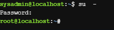

### O Comando `` sudo ``

`` sudo [opções] [comando] ``

O comando `` sudo `` permite que um usuário execute um comando como outro usuário sem criar um novo shell. Em vez disso, para executar um comando com privilégios administrativos, use-o como um argumento para o comando `` sudo ``. Como o comando `` su ``, o comando `` sudo `` assume por padrão que a conta de usuário root deve ser usada para executar comandos. Para especificar uma conta de usuário diferente, use a opção `` -u ``.

Assim como o comando `` su ``, o `` sudo `` também pede senha para entrar no usuário.

Execute o comando `` sl `` como usuário root colocando `` sudo `` na frente dele.

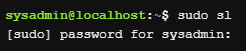

Uma vez concluído o comando, observe que o prompt `` não foi alterado ``, você ainda está conectado como sysadmin. O comando sudo fornece `` apenas acesso administrativo para a execução do comando especificado ``. Esta é uma vantagem, pois reduz o risco de um usuário executar acidentalmente um comando como root. A intenção de executar um comando é clara; o comando é executado como root se prefixado com o comando sudo. Caso contrário, o comando é executado como um usuário regular.

## Permissões
As permissões determinam as maneiras pelas quais diferentes usuários podem interagir com um arquivo ou diretório. Ao listar um arquivo com o comando `` ls -l ``, a saída inclui informações de permissão

Vamos usar as informações de um arquivo exemplo para mostrar as informações necessárias:

    -rw-r--r-- 1 sysadmin sysadmin 647 Dec 20  2017 hello.sh
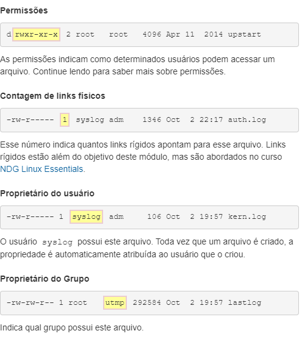
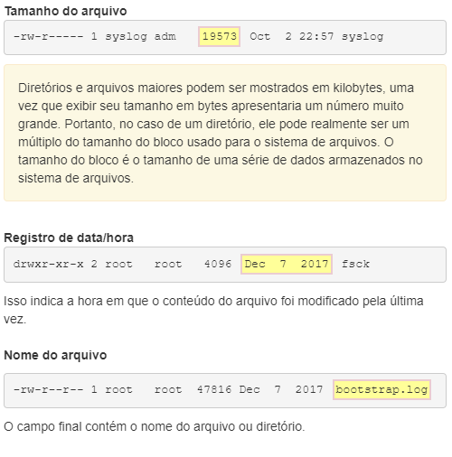

### Tipos de permissão
Permissão `` ler (r)``
    * Arquivo: permite que o conteúdo do arquivo seja lido ou copiado
    * Diretório: Sem permissão de execução no diretório, permite uma lista não detalhada de arquivos. Com permissão de execução, `` ls -l`` pode fornecer uma lista detalhada

Permissão `` escrever (w) ``
    * Arquivo: Permite que o conteúdo seja modificado ou substituído. Permite que arquivos sejam adicionados ou removidos de um diretório.
    * Diretório: Para que essa permissão funcione, o diretório também deve ter permissão de execução.

Permissão `` executar (x) ``
    * Arquivo: Permite que um arquivo seja executado como um processo, embora os arquivos de script exijam permissões de leitura, também.
    * Diretório: Permite que um usuário mude para o diretório se os diretórios pai também tiverem permissões de execução

No caso abaixo, o usuário `` sysadmin `` acaba tendo menos acesso a esse arquivo do que os membros de grupo de staff ou todos os outros. O usuário sysadmin só tem permissões de r--. Não importa se sysadmin é um membro do grupo de staff; uma vez estabelecida a propriedade do usuário, somente as permissões do proprietário do usuário serão aplicadas.

    -rw-rwx. 1 sysadmin staff 999 abr 10 2013 /home/sysadmin/test

### Alterando permissões de arquivo
O comando `` chmod `` é usado para alterar as permissões de um arquivo ou diretório. Somente o usuário root ou usuário que possui o arquivo é capaz de alterar as permissões de um arquivo.

<strong>OBS.:</strong> O comando é chamado de chmod e não de chperm pois as permissões costumavam ser referidas como modos de acesso, então o comando chmod realmente significa alterar os modos de acesso.

Existem duas técnicas para permissões com o comando `` chmod ``: simbólico e octal . O <strong>método simbólico</strong> é bom para alterar um conjunto de permissões de cada vez. O <strong>método octal</strong> especificado ou numérico, requer o conhecimento do valor octal de cada uma das permissões e que todos os três conjuntos de permissões (outros) são necessários a cada vez.

    chmod [<conjunto><ação><permissões>]... arquivo

Para usar o método simbólico de chmod indicar primeiro qual conjunto de permissões está sendo alterado:

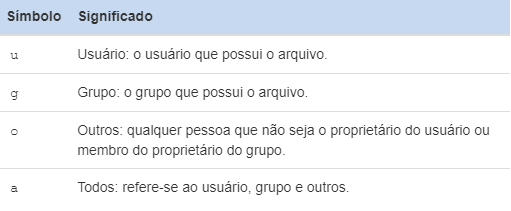

Depois, especifique um símbolo de ação:

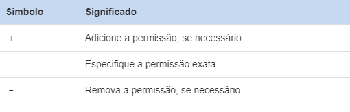

Após um símbolo de ação, especifique uma ou mais permissões a serem executadas:


Finalmente, um espaço e os nomes de caminho para os arquivos atribuírem essas permissões.   

Como o sistema está atualmente conectado como o usuário sysadmin, e sysadmin é o proprietário deste arquivo, dando ao proprietário do usuário a permissão de execução deve permitir que você execute este script. Usando o comando chmod com o caractere `` u `` para representar o conjunto de permissões do proprietário do usuário, o caractere `` + `` para indicar uma permissão está sendo adicionado e o caractere `` x `` para representar a permissão de execução, o comando deve ser executado da seguinte forma:

    chmod u+x hello.sh

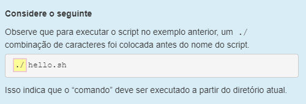

## Alterando a propriedade do arquivo
Inicialmente, o proprietário de um arquivo é o usuário que o cria. O comando `` chown `` é usado para alterar a propriedade de arquivos e diretórios. Alterar o proprietário do usuário requer acesso administrativo. Um usuário regular não pode usar esse comando para alterar o proprietário do usuário de um arquivo, mesmo para dar a propriedade de um de seus próprios arquivos a outro usuário. No entanto, o comando chown também permite alterar a propriedade do grupo, o que pode ser feito pela root ou o proprietário do arquivo.

Para alterar o proprietário do usuário de um arquivo, a seguinte sintaxe pode ser usada. O primeiro argumento, [proprietário], especifica qual usuário deve ser o novo proprietário. O segundo argumento, ARQUIVO, especifica qual propriedade do arquivo está mudando.

    chown [opções] [proprietário] arquivo

Para alternar o proprietário do script hello.sh para o usuário root, use root como o primeiro argumento e hello.sh como o segundo argumento. Não se esqueça de usar o comando sudo para obter os privilégios administrativos necessários. Use a senha netlab123 quando solicitado:


OBS.: Não se esquecer de usar o comando `` sudo `` para obter os privilégios de administrador, se não você não conseguirá alterar a propriedade de um arquivo ou diretório.

## Exibindo arquivos
Existem alguns comandos Linux disponíveis para visualizar o conteúdo dos arquivos. O comando `` cat ``, que significa 'concatenate', é frequentemente usado para visualizar rapidamente o conteúdo de pequenos arquivos.

O comando `` cat `` exibirá todo o conteúdo do arquivo, por isso é recomendado principalmente para arquivos menores onde a saída é limitada e não requer rolagem. Para visualizar o conteúdo de um arquivo usando o comando cat, basta digitar o comando e usar o nome do arquivo que você deseja visualizar como argumento:

    cat [opções] [arquivo]

Ao visualizar arquivos maiores, o comando cat pode resultar em uma saída muito longa que não pode ser pausada para rolar. Um melhor método de visualização de arquivos de texto longos,é com um `` comando de pager `` que possui uma funcionalidade que pode pausar e rolar pela saída do arquivo. Alguns comandos pager: `` more `` ou `` less ``.

Outra maneira de visualizar o conteúdo dos arquivos é usando os comandos `` head `` e `` tail ``. Esses comandos são usados ​​para exibir um número selecionado de linhas na parte superior ou inferior de um arquivo. Servem como uma espécie de filtro.

    head [opções] [arquivo]
    tail [opções] [arquivo]

A opção `` -n `` com os comandos `` head `` e `` tail `` pode ser usada para especificar a quantidade de linhas a serem exibidas. Para usar a opção -n, especifique a quantidade de linhas do arquivo que deseja exibir após a opção e use o nome do arquivo como argumento:

    head -n número_de_linhas nome_do_arquivo

## Copiando arquivos
O comando `` cp `` é usado para copiar arquivos. Ele requer pelo menos dois argumentos: uma origem e um destino.

    cp [opções] fonte destino

 Por exemplo, para copiar o arquivo /etc/passwd para o diretório atual, use o seguinte comando:

 

 O segundo argumento é o caratere (.). Lembre-se da seção Alterando Diretórios que é um atalho que representa o diretório atual.

 O resultado da execução do comando anterior criaria uma cópia do conteúdo do arquivo /etc/passwd no diretório Documents, uma vez que esse é o nosso diretório atual.

 As permissões podem ter um impacto nos comandos de gerenciamento de arquivos, como o comando `` cp ``. Para copiar um arquivo, é necessário ter permissão de execução para acessar o diretório onde o arquivo está localizado e a permissão de leitura para o arquivo que está sendo copiado. Também é necessário ter permissão de gravação e execução no diretório para o qual o arquivo está sendo copiado.

 ---

Criar cópias de arquivos pode ser útil por vários motivos:

* Se uma cópia de um arquivo for criada antes que as alterações sejam feitas, é possível voltar ao original.
* Uma cópia de um arquivo pode ser usada para transferir um arquivo para dispositivos de mídia removíveis.
* Uma cópia de um documento existente pode ser usada como modelo para um novo documento.

---

O comando `` dd `` é um utilitário para copiar arquivos ou partições inteiras no nível de bits.
    
    dd [opções] operando

Este comando tem vários recursos úteis, inclusive:

* Pode ser usado para clonar ou excluir (limpar) discos ou partições inteiros.
* Pode ser usado para copiar dados brutos para dispositivos removíveis, como unidades USB e CDROMs.
* Pode fazer backup e restaurar o MBR (Master Boot Record).
* Pode ser usado para criar um arquivo de tamanho específico preenchido com zeros binários, que pode ser usado como um arquivo de swap (memória virtual).

O comando dd usa argumentos especiais para especificar como ele funcionará. A seguir ilustra alguns dos argumentos mais comumente usados:

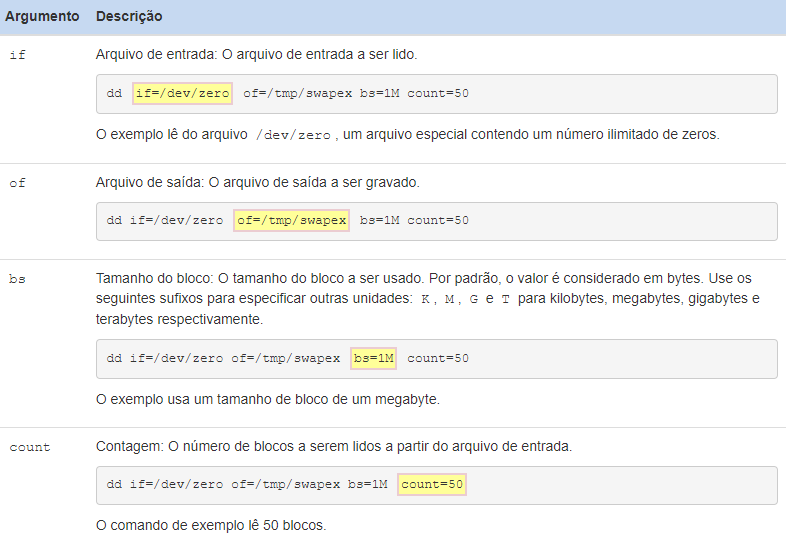

## Mover arquivos
O comando `` mv `` é usado para mover um arquivo de um local no sistema de arquivos para outro.

    mv fonte destino

O comando `` mv `` requer pelo menos dois argumentos. O primeiro argumento é a fonte, um caminho para o arquivo a ser movido. O segundo argumento é o destino, um caminho para onde o arquivo será movido. Os arquivos a serem movidos às vezes são chamados de origem, e o local onde os arquivos devem ser colocados é chamado de destino.

Se um arquivo for movido de um diretório para outro sem especificar um novo nome para o arquivo, ele manterá seu nome original.

O comando `` mv `` é capaz de mover vários arquivos, desde que o argumento final fornecido ao comando seja o destino.

Mover um arquivo dentro do mesmo diretório é uma maneira eficaz de renomeá-lo. Por exemplo, no exemplo a seguir, o arquivo animals.txt recebe um novo nome de zoo.txt:

    mv animals.txt zoo.txt

As permissões podem ter um impacto nos comandos de gerenciamento de arquivos, como o comando `` mv ``. Mover um arquivo requer permissões de gravação e execução tanto nos diretórios de origem quanto nos de destino.

## Removendo arquivos
O comando `` rm `` é usado para excluir arquivos e diretórios. É importante ter em mente que arquivos e diretórios excluídos não entram em uma “lixeira” como acontece com sistemas operacionais voltados para a área de trabalho. Quando um arquivo é excluído com o comando `` rm ``, ele quase sempre desaparece permanentemente.

    rm [opções] arquivo

Sem opções, o comando rm é normalmente usado para remover arquivos regulares. O comando `` rm `` ignorará os diretórios que é solicitado a remover; para excluir um diretório, use uma opção recursiva, seja as opções `` -r `` ou `` -R `` . Basta ter cuidado, uma vez que estas opções são “recursivas”, isto irá eliminar todos os arquivos e todos os subdiretórios.

As permissões podem ter um impacto nos comandos de gerenciamento de arquivos, como o comando `` rm ``. Para excluir um arquivo dentro de um diretório, um usuário deve ter permissão de gravação e execução em um diretório. Normalmente, os usuários regulares só têm esse tipo de permissão em seu diretório (home) pessoal e seus subdiretórios.

## Filtragem de Entrada
O comando `` grep `` é um filtro de texto que irá procurar linhas de entrada e retorno que contenham uma correspondência para um determinado padrão.

    grep [opções] padrão [arquivo]

Por exemplo, o arquivo passwd que copiamos anteriormente para o diretório Documents contém os detalhes de contas especiais do sistema e contas de usuário no sistema. Este arquivo pode ser muito grande, no entanto, o comando `` grep `` pode ser usado filtrar informações sobre um usuário específico, como o usuário sysadmin. Use sysadmin como argumento de padrão e passwd como argumento de arquivo:

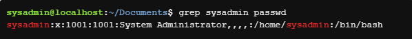

O comando acima retornou a linha do passwd que contém o sysadmin padrão.

### Expressões Regulares
As expressões regulares têm duas formas comuns: básica e estendida. A maioria dos comandos que usam expressões regulares pode interpretar expressões regulares básicas. No entanto, expressões regulares estendidas não estão disponíveis para todos os comandos e uma opção de comando é normalmente necessária para que eles funcionem corretamente.

A tabela a seguir resume os caracteres básicos de expressão regular:

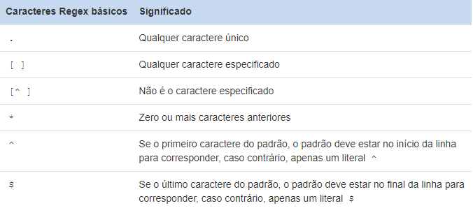

A tabela a seguir resume as expressões regulares estendidas, que devem ser usadas com o comando `` egrep `` ou a opção `` -E `` com o comando `` grep ``:

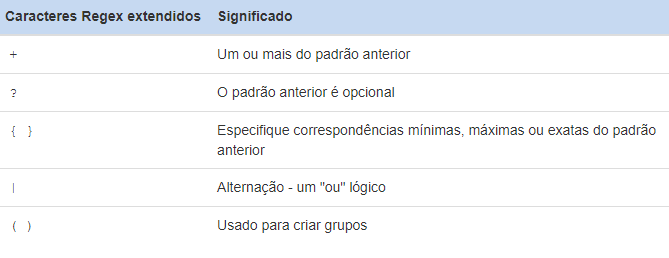

### Padrões básicos
Expressões regulares são padrões que apenas certos comandos são capazes de interpretar. Expressões regulares podem ser expandidas para corresponder a determinadas sequências de caracteres no texto. Os exemplos exibidos nesta página farão uso de expressões regulares para demonstrar seu poder quando usado com o comando `` grep ``. Além disso, esses exemplos fornecem uma demonstração muito visual de como as expressões regulares funcionam, o texto correspondente será exibido em uma cor vermelha.

#### Caracteres Âncora
Caracteres âncora são uma das formas como expressões regulares podem ser usadas para restringir os resultados da pesquisa. Por exemplo, a root padrão aparece muitas vezes no arquivo /etc/passwd:

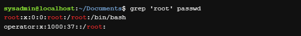

Para evitar que o shell os intérprete erroneamente como caracteres especiais, esses padrões devem ser protegidos por aspas fortes, o que significa simplesmente colocá-los entre aspas simples.

O <strong>primeiro caractere</strong> âncora `` ^ `` é usado para garantir que um padrão apareça no início da linha. Por exemplo, para encontrar todas as linhas em /etc/passwd que começam com root use o padrão ^root. Observe que ^ deve ser o primeiro caractere no padrão para ser efetivo.

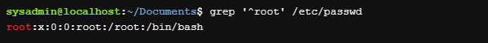

O <strong>segundo caractere</strong> âncora `` $ `` pode ser usado para garantir que um padrão apareça no final da linha, reduzindo assim efetivamente os resultados da pesquisa. Para encontrar as linhas que terminam com um r no arquivo alpha-first.txt, use o padrão r$:

    grep 'r$' alpha-first.txt

Novamente, a posição deste caractere é importante, o $ deve ser o último caractere no padrão para ser eficaz como uma âncora.

#### Combine um único caractere com .
Uma das expressões mais úteis é o caractere de ponto `` .. `` Ele irá corresponder a qualquer caractere, exceto para o novo caractere de linha. O padrão r..f encontraria qualquer linha que contenhaa letra r seguida por exatamente dois caracteres (que pode ser qualquer caractere exceto uma nova linha) e, em seguida, a letra f:

    grep 'r..f' red.txt

Este caractere pode ser usado qualquer número de vezes. Para localizar todas as palavras que tenham pelo menos quatro caracteres, o seguinte padrão pode ser usado:

    grep '....' red.txt

A linha não precisa ser uma correspondência exata, ela simplesmente deve conter o padrão.

#### Corresponder um único caractere com []
Os colchetes `` [] `` correspondem a um único caractere da lista ou intervalo de caracteres possíveis contidos entre parênteses.

Para encontrar todas as linhas em um arquivo que têm um número neles, use o padrão [0123456789] ou [0-9]:

    grep '[0-9]' profile.txt

Por outro lado, para encontrar todas as linhas que contêm caracteres não numéricos, insira um `` ^ `` como o primeiro caractere dentro dos colchetes. Este caractere nega os caracteres listados

    grep '[^0-9]' profile.txt

Não confunda [^0-9] para corresponder às linhas que não contêm números. Na verdade, corresponde a linhas que contêm não-números. Olhe para o arquivo original para ver a diferença. A terceira e a sexta linhas contêm apenas números, elas não contêm os não-números então essas linhas não correspondem.

Quando outros caracteres de expressão regular são colocados dentro de colchetes, eles são tratados como caracteres literais. Por exemplo, o . normalmente corresponde a qualquer caractere, mas colocado dentro dos colchetes, então ele irá apenas corresponder a si mesmo. No próximo exemplo, somente linhas que contêm o . são correspondidos.

    grep '[.]' profile.txt

#### Combine um personagem ou padrões repetidos com *
O caractere de expressão regular `` * `` é usado para corresponder zero ou mais ocorrências de um caractere ou padrão que o precede. Por exemplo `` e* `` corresponderia a zero ou mais ocorrências da letra e:

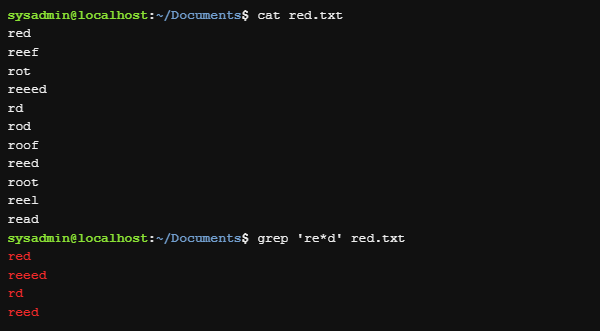

Também é possível combinar zero ou mais ocorrências de uma lista de caracteres utilizando os colchetes. O padrão [oe]* usado no exemplo a seguir corresponderá a zero ou mais ocorrências do caractere o ou do caractere e:

    grep 'r[oe]*d' red.txt

#### Entrada padrão
Se um nome de arquivo não for fornecido, o comando `` grep `` será lido a partir de entrada padrão, que normalmente vem do teclado com entrada fornecida pelo usuário que executa o comando. Isso fornece uma experiência interativa com `` grep `` onde o usuário digita na entrada e os filtros do grep à medida que vai. Sinta-se livre para experimentá-lo, basta pressionar Ctrl-D quando estiver pronto para retornar ao prompt.

    grep 'red'

Ao dar enter no comando acima, o prompt exigirá uma entrada, que será digitada ali na hora, como o argumento é `` 'red' ``, todo red que for digitado será filtrado.

## Desligando
O comando `` shutdown `` faz com que o sistema seja desligado de forma segura. Todos os usuários conectados são notificados de que o sistema está sendo desativado e, nos últimos cinco minutos que antecederam o desligamento, novos logins são evitados.

    shutdown [opções] tempo [mensagem]

Este comando requer acesso administrativo, então não se esqueça de usar o comando `` su ``

Ao contrário de outros comandos usados para desligar o sistema, o comando `` shutdown `` requer um argumento de tempo especificando quando o desligamento deve começar. Os formatos deste argumento de tempo podem ser a palavra `` now `` (agora), uma hora do dia no formato `` hh:mm `` ou o número de minutos para atrasar no formato `` +minutos ``.

O comando `` shutdown `` também tem um argumento de mensagem opcional, indicando uma mensagem que aparecerá nos terminais de todos os usuários. Por exemplo:

    shutdown +1 "Goodbye World!"

## Configuração de rede
O comando `` ifconfig `` significa “configuração de interface” e é usado para exibir informações sobre a configuração de rede.

    ifconfig [opções]

O comando `` ifconfig `` também pode ser usado para modificar temporariamente as configurações de rede. Normalmente, essas alterações devem ser permanentes, portanto, usar o comando `` ifconfig `` para fazer essas alterações é bastante raro.

O comando `` ping `` é usado para verificar a conectividade entre dois computadores. Ele faz isso enviando pacotes para outra máquina em uma rede. Se o remetente receber uma resposta, deverá ser possível conectar-se a essa máquina.

As informações são enviadas usando 'pacotes'; a unidade encapsulada de dados enviados através de uma rede. Para que os pacotes encontrem o outro computador, eles precisarão de um endereço. O comando `` ping `` usa endereços IP para identificar um computador na rede ao qual ele deseja se conectar.

Por padrão, o comando `` ping `` continuará enviando pacotes até que o comando break (CTL-C) seja inserido no console. Para limitar quantos pings são enviados, use a opção `` -c `` seguida do número de pings a serem enviados. O exemplo abaixo mostra ping sendo limitado a 4 iterações com -c 4.

Se o comando ping for bem-sucedido, você verá uma saída como a seguinte:

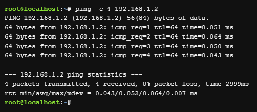

Se o comando ping falhar, você receberá uma mensagem informando: Destination Host Unreachable (Host de destino inacessível)

O comando `` ping `` pode falhar mesmo que a máquina remota esteja se conectando. Isso ocorre porque alguns administradores configuram suas máquinas, ou mesmo redes inteiras, para não responder a solicitações de ping como medida de segurança. O comando `` ping `` também funciona com um nome de host ou nome de domínio, como yahoo.com. Usando este primeiro, se o comando ping for bem sucedido, haverá uma resolução apropriada do nome e o endereço IP também estará funcionando corretamente.

## Exibindo processos
A execução de um comando resulta em algo chamado processo. No sistema operacional Linux, os processos são executados com os privilégios do usuário que executa o comando. Isso permite que os processos sejam limitados a determinados recursos com base na identidade do usuário.

O comando `` ps `` pode ser usado para listar processos.

    ps [opções]

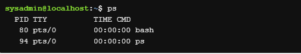

O comando `` ps `` exibirá os processos que estão sendo executados no terminal atual por padrão. No exemplo acima, a linha inferior é o processo criado pela execução do comando ps. A saída inclui as seguintes colunas de informações:

* PID: O identificador do processo, que é exclusivo para o processo. Esta informação é útil para controlar o processo pelo seu número de identificação.
* TTY: O nome do terminal em que o processo está sendo executado. Esta informação é útil para distinguir entre diferentes processos que têm o mesmo nome.
* TIME: A quantidade total de tempo do processador usado pelo processo. Normalmente, essas informações não são usadas por usuários comuns.
* CMD: O comando que iniciou o processo.

A opção `` -e `` exibirá todos os processos, ao invés de visualizar apenas os processos em execução no terminal atual.

Normalmente, a opção `` -f `` (`` -ef ``) também é usada, pois fornece mais detalhes na saída do comando, incluindo opções e argumentos.

## Gerenciamento de pacotes 
O gerenciamento de pacotes é um sistema pelo qual o software pode ser instalado, atualizado, consultado ou removido de um sistema de arquivos.

No nível mais baixo do sistema de gerenciamento de pacotes Debian está o comando `` dpkg ``. Este comando pode ser complicado para usuários iniciantes do Linux, então a Advanced Package Tool, `` apt-get ``, um programa front-end para a ferramenta `` dpkg ``, torna o gerenciamento de pacotes ainda mais fácil.

Muitos dos comandos de gerenciamento de pacotes exigem acesso administrativo, portanto, eles serão prefaciados com o comando `` sudo ``.

### Instalando pacotes
Os arquivos de pacote são normalmente instalados baixando-os diretamente de repositórios localizados em servidores de Internet. Os repositórios Debian contêm mais de 65.000 pacotes diferentes de software. Antes de instalar um pacote, é uma boa prática usar a atualização da lista de pacotes disponíveis usando o comando `` apt-get update ``.

    sudo apt-get update

Para procurar palavras-chave dentro desses pacotes, você pode usar o comando `` apt-cache search ``.

    apt-cache search [palavra chave]

A palavra-chave usada deve corresponder a parte do nome ou descrição do pacote que deve ser localizado. Várias palavras-chave podem ser usadas para esclarecer ainda mais a pesquisa; por exemplo, o termo de pesquisa `` servidor web `` forneceria melhores resultados de web ou servidor.

Depois de encontrar o pacote que deseja instalar, você pode instalá-lo com o comando `` apt-get install ``

    sudo apt-get install [pacote]

### Atualizando pacotes
O comando apt-get install também pode atualizar um pacote, se esse pacote estiver instalado e uma versão mais recente estiver disponível. Se o pacote ainda não estiver no sistema, ele será instalado; se estiver no sistema, ele será atualizado.

A atualização de todos os pacotes do sistema deve ser feita em duas etapas. Primeiro, atualize o cache de todos os pacotes disponíveis com o `` apt-get update ``. Em segundo lugar, execute o comando `` apt-get upgrade `` e todos os pacotes e dependências serão atualizados.

    apt-get update
    apt-get upgrade

### Removendo Pacotes
O comando `` apt-get `` é capaz de remover ou limpar um pacote. A diferença entre os dois é que a limpeza apaga todos os arquivos de pacote, enquanto a remoção exclui todos os arquivos de configuração do pacote, exceto os arquivos de configuração.

Um administrador pode executar o comando `` apt-get remove `` para remover um pacote ou o comando `` apt-get purge `` para limpar um pacote completamente do sistema.