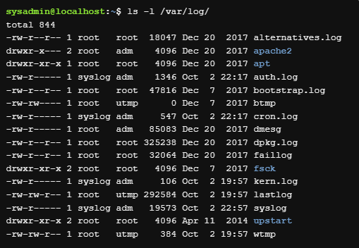

# Curso sobre Linux (Netacad)

## Curso LINUX
* O que é o Linux?
    * Linux é um software de sistema operacional que é executado em um sistema de computador de hardware.

### GUI (Interface gráfica do usuário)
* Por trás dessa interface. está um código que um programador desenvolveu.
* Além de usar a GUI, os desktops Linux também utilizam outra interface mais eficiente, a interface de linha de comando (CLI).

### CLI
* Interface baseada em texto que aceita comandos digitados na tela
    * O que é um comando? Um comando é um programa de software que, quando executado na CLI (interface de linha de comando), executa uma ação no computador.
    * A interface baseada em comandos é muitas vezes um "herói" quando se trata de uma administração do sistema e solução de problemas
    * Ferramenta poderosa que frequentemente é o principal método usado para dispositivos de consumo de energia, servidores de computação em nuvem extremamente pequenas e capazes de tudo o que há entre eles

### Empresas e instituições que usam LINUX
* NASA 
* McDonald's
* New York Stock Exchange (NYSE)
* DreamWorks Animation
* Departamento de Defesa dos EUA

### Comandos LINUX
O nome do comando é geralmente associado ao que ele faz ou no que o desenvolvedor que criou o comando acha que descreve a melhor função do comando.
A maioria dos comandos segue um padrão simples de sintaxe `` comando [opcoes…] [argumentos…] ``, ou seja, se digita o comando e em seguida quaisquer opções e/ou argumentos antes de pressionar a tecla Enter. // Normalmente, as opções alteram o comportamento do comando e os argumentos são itens ou valores para o comando agir.

------------------------------------------------------------------------------
* ls - exibe uma lista de arquivos contidos no diretório atual
* aptitude - ferramenta de gerenciamento de pacotes disponível em algumas distribuições Linux (este comando aceitará `` moo `` como argumento)
* pwd - imprime o diretório de trabalho, sua localização atual dentro do sistema de arquivos
* cd - navega pela estrutura do sistema de arquivos

### Argumentos
Um argumento pode ser usado para especificar algo para o comando agir.
* O comando ``` ls ``` pode ser dado o nome de um diretório, ex.: ls Documents // o comando ` listará o conteúdo ` (ou lista de arquivos) do diretório Documents.

### Opções
Usadas para alterar o comportamento de um comando. Anteriormente, o comando ls foi usado para listar o conteúdo de um diretório.
No exemplo a seguir, a opção `` -l `` é fornecida ao comando ls, o que resulta em uma `` saída de “exibição longa” ``, o que significa que a saída fornece `` mais informações sobre cada um dos arquivos `` listados:


    Observe que, no comando acima, o -l é o "L" minúsculo.

Muitas vezes, o caractere é escolhido para ser mnemônico para o seu propósito, como escolher a letra `` l para longo `` ou `` r para reverso ``. Por padrão, o comando ls imprime os resultados em ordem alfabética, portanto, adicionar a opção -r irá imprimir os resultados em ordem alfabética inversa.
* As opções podem ser usadas de uma só vez, por exemplo `` ls -l -r `` ou `` ls -rl `` ou `` ls -lr ``. Todas as opções vão gerar o mesmo resultado.

### Diretórios
Os arquivos são usados para armazenar dados tais como texto, gráficos e programas. Os diretórios são um tipo de arquivo usado para armazenar outros arquivos.
Para descobrir onde você está atualmente localizado dentro do sistema de arquivos, o comando pwd pode ser usado. O comando pwd imprime o diretório de trabalho, sua localização atual dentro do sistema de arquivos:

    pwd [OPÇÕES]

A saída do comando acima indica que o usuário está atualmente em sua pasta pessoal, mostrada no sistema de arquivos abaixo:


#### Alterando diretórios
Os diretórios são um tipo de arquivo usado para armazenar outros arquivos, eles fornecem uma estrutura organizacional hierárquica, como na imagem abaixo:


Para navegar pela estrutura do sistema de arquivos, use o comando `` cd `` (change directory) para alterar diretórios.

    cd [opções] [caminho]

Se você olhar novamente para o gráfico acima, você verá que o diretório Documents está localizado dentro do diretório home, onde você se encontra atualmente. Para mover para o diretório Documents, use-o como argumento para o comando `` cd ``:


Os diretórios são equivalentes a pastas no Windows e Mac OS. Assim como esses sistemas operacionais mais populares, uma estrutura de diretórios Linux tem um nível superior. Não é chamado de “Meu Computador”, mas sim o diretório root (raiz) e é representado pelo caractere "/". Para mover para o diretório root, use o caractere "/" como argumento para o comando `` cd ``.

O argumento para o comando cd é mais do que apenas o nome de um diretório, na verdade é um caminho. Um caminho é uma lista de diretórios separados pelo caractere "/". Por exemplo, `` /home/sysadmin `` é o caminho para seu diretório home.

------------------------------------------------------------------------------

Se você pensar no sistema de arquivos como um mapa, os caminhos são as direções passo a passo; eles podem ser usados para indicar a localização de qualquer arquivo dentro do sistema de arquivos. Existem dois tipos de caminhos: absoluto e relativo. Os caminhos absolutos começam na root do sistema de arquivos, os caminhos relativos começam a partir da sua localização atual.
* Caminho absoluto: um caminho absoluto permite que você especifique a localização exata de um diretório.
* Caminho relativo: um caminho relativo fornece direções para um arquivo relativo à sua localização atual no sistema de arquivos. Os caminhos relativos não começam com o caractere "/", eles começam com o nome de um diretório. Um caminho relativo começa a partir do diretório atual. Use o caractere / para separar os nomes dos diretórios e o resultado School/Art é um caminho relativo do diretório Documents para o diretório Art:


------------------------------------------------------------------------------
#### Atalhos
* Os caracteres `` ".." ``: Independentemente do diretório em que você esteja, os caracteres ".." sempre representa um diretório maior em relação ao diretório atual, às vezes referido como o diretório pai. Mais resumidamente, os caracteres ".." são usados para voltar um diretório.
* O caractere `` "." ``: Independentemente do diretório em que você esteja, o caractere . sempre representa seu diretório atual. Para o cd este atalho não é muito útil, mas será útil para comandos cobertos nas seções subsequentes.
* O caractere `` "~" ``: Usado para retornar ao seu diretório home a qualquer momento, execute o seguinte comando: cd ~.

#### Listando arquivos
Por padrão, quando o comando ls é usado sem opções ou argumentos, ele irá listar os arquivos no diretório atual.
Para saber os detalhes sobre um arquivo, tais como, o tipo de arquivo, as permissões, propriedade ou o carimbo de data/hora, execute uma listagem longa usando a opção `` -l `` para o comando ls. Abaixo, uma listagem do diretório /var/log é usada como um exemplo, uma vez que fornece uma variedade de saídas:



Cada linha corresponde a um arquivo contido no diretório. As informações podem ser divididas em campos separados por espaços. Os campos são os seguintes:


Na verdade, o primeiro campo contém dez caracteres, onde o primeiro caractere indica o tipo de arquivo e os próximos nove especificam permissões. Os tipos de arquivo são:


O primeiro arquivo alternatives.log é um arquivo regular -, enquanto o segundo arquivo apache2 é um diretório d.

Permissões: indicam como determinados usuários podem acessar um arquivo.
* d `` rwxr-xr-x `` 2 root   root   4096 Apr 11  2014 upstart

### Permissões
As permissões determinam as maneiras pelas quais diferentes usuários podem interagir com um arquivo ou diretório.

Vamos usar as informações de um arquivo exemplo para mostrar as informações necessárias:

    -rw-r--r-- 1 sysadmin sysadmin 647 Dec 20  2017 hello.sh

