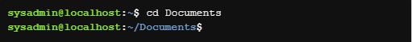
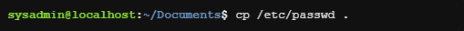

# Curso sobre Linux (Netacad)

## Curso LINUX
* O que é o Linux?
    * Linux é um software de sistema operacional que é executado em um sistema de computador de hardware.

## GUI (Interface gráfica do usuário)
* Por trás dessa interface. está um código que um programador desenvolveu.
* Além de usar a GUI, os desktops Linux também utilizam outra interface mais eficiente, a interface de linha de comando (CLI).

## CLI
* Interface baseada em texto que aceita comandos digitados na tela
    * O que é um comando? Um comando é um programa de software que, quando executado na CLI (interface de linha de comando), executa uma ação no computador.
    * A interface baseada em comandos é muitas vezes um "herói" quando se trata de uma administração do sistema e solução de problemas
    * Ferramenta poderosa que frequentemente é o principal método usado para dispositivos de consumo de energia, servidores de computação em nuvem extremamente pequenas e capazes de tudo o que há entre eles

## Empresas e instituições que usam LINUX
* NASA 
* McDonald's
* New York Stock Exchange (NYSE)
* DreamWorks Animation
* Departamento de Defesa dos EUA

## Comandos LINUX
O nome do comando é geralmente associado ao que ele faz ou no que o desenvolvedor que criou o comando acha que descreve a melhor função do comando.
A maioria dos comandos segue um padrão simples de sintaxe `` comando [opcoes…] [argumentos…] ``, ou seja, se digita o comando e em seguida quaisquer opções e/ou argumentos antes de pressionar a tecla Enter. // Normalmente, as opções alteram o comportamento do comando e os argumentos são itens ou valores para o comando agir.

------------------------------------------------------------------------------
* `` ls `` - exibe uma lista de arquivos contidos no diretório atual
* aptitude - ferramenta de gerenciamento de pacotes disponível em algumas distribuições Linux (este comando aceitará `` moo `` como argumento)
* `` pwd `` - imprime o diretório de trabalho, sua localização atual dentro do sistema de arquivos
* `` cd `` - navega pela estrutura do sistema de arquivos
* `` su `` - permite que você atue temporariamente como um usuário diferente. Por padrão, se uma conta de usuário não for especificada, o comando su abrirá um novo shell como usuário root, que fornece privilégios administrativos
* `` sudo `` - o comando sudo permite que um usuário execute um comando como outro usuário sem criar um novo shell. Em vez disso, para executar um comando com privilégios administrativos, use-o como um argumento para o comando `` sudo ``. Como o comando `` su ``, o comando `` sudo `` assume por padrão que a conta de usuário root deve ser usada para executar comandos
* `` chmod `` - usado para alterar as permissões de um arquivo ou diretório. Somente o usuário root ou o usuário que possui o arquivo é capaz de alterar as permissões de um arquivo
* `` chown `` - usado para alterar a propriedade de arquivos e diretórios
* `` cat `` - usado para visualizar rapidamente o conteúdo de pequenos arquivos
* `` head `` - usado para filtrar a visualização de um arquivo para a parte superior dele
* `` tail `` - usado para filtrar a visualização de um arquivo para a parte inferior dele
* `` cp `` - usado para copiar arquivos
* `` dd `` - é um utilitário para copiar arquivos ou partições inteiras no nível de bits
* `` mv `` - usado para mover um arquivo de um local no sistema de arquivos para outro
* `` rm `` - usado para excluir arquivos e diretórios
* `` grep `` - é um filtro de texto que irá procurar linhas de entrada e retorno que contenham uma correspondência para um determinado padrão

## Argumentos
Um argumento pode ser usado para especificar algo para o comando agir.
* O comando ``` ls ``` pode ser dado o nome de um diretório, ex.: ls Documents // o comando ` listará o conteúdo ` (ou lista de arquivos) do diretório Documents.

## Opções
Usadas para alterar o comportamento de um comando. Anteriormente, o comando ls foi usado para listar o conteúdo de um diretório.
No exemplo a seguir, a opção `` -l `` é fornecida ao comando ls, o que resulta em uma `` saída de “exibição longa” ``, o que significa que a saída fornece `` mais informações sobre cada um dos arquivos `` listados:


    Observe que, no comando acima, o -l é o "L" minúsculo.

Muitas vezes, o caractere é escolhido para ser mnemônico para o seu propósito, como escolher a letra `` l para longo `` ou `` r para reverso ``. Por padrão, o comando ls imprime os resultados em ordem alfabética, portanto, adicionar a opção -r irá imprimir os resultados em ordem alfabética inversa.
* As opções podem ser usadas de uma só vez, por exemplo `` ls -l -r `` ou `` ls -rl `` ou `` ls -lr ``. Todas as opções vão gerar o mesmo resultado.

## Diretórios
Os arquivos são usados para armazenar dados tais como texto, gráficos e programas. Os diretórios são um tipo de arquivo usado para armazenar outros arquivos.
Para descobrir onde você está atualmente localizado dentro do sistema de arquivos, o comando pwd pode ser usado. O comando pwd imprime o diretório de trabalho, sua localização atual dentro do sistema de arquivos:

    pwd [OPÇÕES]

A saída do comando acima indica que o usuário está atualmente em sua pasta pessoal, mostrada no sistema de arquivos abaixo:


### Alterando diretórios
Os diretórios são um tipo de arquivo usado para armazenar outros arquivos, eles fornecem uma estrutura organizacional hierárquica, como na imagem abaixo:


Para navegar pela estrutura do sistema de arquivos, use o comando `` cd `` (change directory) para alterar diretórios.

    cd [opções] [caminho]

Se você olhar novamente para o gráfico acima, você verá que o diretório Documents está localizado dentro do diretório home, onde você se encontra atualmente. Para mover para o diretório Documents, use-o como argumento para o comando `` cd ``:



Os diretórios são equivalentes a pastas no Windows e Mac OS. Assim como esses sistemas operacionais mais populares, uma estrutura de diretórios Linux tem um nível superior. Não é chamado de “Meu Computador”, mas sim o diretório root (raiz) e é representado pelo caractere "/". Para mover para o diretório root, use o caractere "/" como argumento para o comando `` cd ``.

O argumento para o comando cd é mais do que apenas o nome de um diretório, na verdade é um caminho. Um caminho é uma lista de diretórios separados pelo caractere "/". Por exemplo, `` /home/sysadmin `` é o caminho para seu diretório home.

------------------------------------------------------------------------------

Se você pensar no sistema de arquivos como um mapa, os caminhos são as direções passo a passo; eles podem ser usados para indicar a localização de qualquer arquivo dentro do sistema de arquivos. Existem dois tipos de caminhos: absoluto e relativo. Os caminhos absolutos começam na root do sistema de arquivos, os caminhos relativos começam a partir da sua localização atual.
* Caminho absoluto: um caminho absoluto permite que você especifique a localização exata de um diretório.
* Caminho relativo: um caminho relativo fornece direções para um arquivo relativo à sua localização atual no sistema de arquivos. Os caminhos relativos não começam com o caractere "/", eles começam com o nome de um diretório. Um caminho relativo começa a partir do diretório atual. Use o caractere / para separar os nomes dos diretórios e o resultado School/Art é um caminho relativo do diretório Documents para o diretório Art:


------------------------------------------------------------------------------
### Atalhos
* Os caracteres `` ".." ``: Independentemente do diretório em que você esteja, os caracteres ".." sempre representa um diretório maior em relação ao diretório atual, às vezes referido como o diretório pai. Mais resumidamente, os caracteres ".." são usados para voltar um diretório.
* O caractere `` "." ``: Independentemente do diretório em que você esteja, o caractere . sempre representa seu diretório atual. Para o cd este atalho não é muito útil, mas será útil para comandos cobertos nas seções subsequentes.
* O caractere `` "~" ``: Usado para retornar ao seu diretório home a qualquer momento, execute o seguinte comando: cd ~.

### Listando arquivos
Por padrão, quando o comando ls é usado sem opções ou argumentos, ele irá listar os arquivos no diretório atual.
Para saber os detalhes sobre um arquivo, tais como, o tipo de arquivo, as permissões, propriedade ou o carimbo de data/hora, execute uma listagem longa usando a opção `` -l `` para o comando ls. Abaixo, uma listagem do diretório /var/log é usada como um exemplo, uma vez que fornece uma variedade de saídas:


Cada linha corresponde a um arquivo contido no diretório. As informações podem ser divididas em campos separados por espaços. Os campos são os seguintes:


Na verdade, o primeiro campo contém dez caracteres, onde o primeiro caractere indica o tipo de arquivo e os próximos nove especificam permissões. Os tipos de arquivo são:


O primeiro arquivo alternatives.log é um arquivo regular -, enquanto o segundo arquivo apache2 é um diretório d.


## Acesso Administrativo
Existem muitos comandos Linux que lidam com informações confidenciais, como senhas, hardware do sistema, ou de outra forma operam sob outras circunstâncias excepcionais. Impedir que usuários regulares executem esses comandos ajuda a proteger o sistema. Fazer login como usuário root fornece acesso administrativo, permitindo a execução de alguns dos comandos privilegiados. 

### O Comando `` su ``

`` su [opções] [nome-do-usuário] ``

O comando `` su `` permite que você atue temporariamente como um usuário diferente. Ele faz isso criando um novo shell. O shell é simplesmente um console de entrada de texto que permite digitar comandos. Por padrão, se uma conta de usuário não for especificada, o comando su abrirá um novo shell como usuário root, que fornece privilégios administrativos. Para sair e retornar à conta, use o comando `` exit ``.

Depois de executar o comando su, uma senha é necessária. Como medida de segurança, a senha não estará visível à medida que for digitada.


### O Comando `` sudo ``

`` sudo [opções] [comando] ``

O comando `` sudo `` permite que um usuário execute um comando como outro usuário sem criar um novo shell. Em vez disso, para executar um comando com privilégios administrativos, use-o como um argumento para o comando `` sudo ``. Como o comando `` su ``, o comando `` sudo `` assume por padrão que a conta de usuário root deve ser usada para executar comandos. Para especificar uma conta de usuário diferente, use a opção `` -u ``.

Assim como o comando `` su ``, o `` sudo `` também pede senha para entrar no usuário.

Execute o comando `` sl `` como usuário root colocando `` sudo `` na frente dele.


Uma vez concluído o comando, observe que o prompt `` não foi alterado ``, você ainda está conectado como sysadmin. O comando sudo fornece `` apenas acesso administrativo para a execução do comando especificado ``. Esta é uma vantagem, pois reduz o risco de um usuário executar acidentalmente um comando como root. A intenção de executar um comando é clara; o comando é executado como root se prefixado com o comando sudo. Caso contrário, o comando é executado como um usuário regular.

## Permissões
As permissões determinam as maneiras pelas quais diferentes usuários podem interagir com um arquivo ou diretório. Ao listar um arquivo com o comando `` ls -l ``, a saída inclui informações de permissão

Vamos usar as informações de um arquivo exemplo para mostrar as informações necessárias:

    -rw-r--r-- 1 sysadmin sysadmin 647 Dec 20  2017 hello.sh


### Tipos de permissão
Permissão `` ler (r)``
    * Arquivo: permite que o conteúdo do arquivo seja lido ou copiado
    * Diretório: Sem permissão de execução no diretório, permite uma lista não detalhada de arquivos. Com permissão de execução, `` ls -l`` pode fornecer uma lista detalhada

Permissão `` escrever (w) ``
    * Arquivo: Permite que o conteúdo seja modificado ou substituído. Permite que arquivos sejam adicionados ou removidos de um diretório.
    * Diretório: Para que essa permissão funcione, o diretório também deve ter permissão de execução.

Permissão `` executar (x) ``
    * Arquivo: Permite que um arquivo seja executado como um processo, embora os arquivos de script exijam permissões de leitura, também.
    * Diretório: Permite que um usuário mude para o diretório se os diretórios pai também tiverem permissões de execução

No caso abaixo, o usuário `` sysadmin `` acaba tendo menos acesso a esse arquivo do que os membros de grupo de staff ou todos os outros. O usuário sysadmin só tem permissões de r--. Não importa se sysadmin é um membro do grupo de staff; uma vez estabelecida a propriedade do usuário, somente as permissões do proprietário do usuário serão aplicadas.

    -rw-rwx. 1 sysadmin staff 999 abr 10 2013 /home/sysadmin/test

### Alterando permissões de arquivo
O comando `` chmod `` é usado para alterar as permissões de um arquivo ou diretório. Somente o usuário root ou usuário que possui o arquivo é capaz de alterar as permissões de um arquivo.

<strong>OBS.:</strong> O comando é chamado de chmod e não de chperm pois as permissões costumavam ser referidas como modos de acesso, então o comando chmod realmente significa alterar os modos de acesso.

Existem duas técnicas para permissões com o comando `` chmod ``: simbólico e octal . O <strong>método simbólico</strong> é bom para alterar um conjunto de permissões de cada vez. O <strong>método octal</strong> especificado ou numérico, requer o conhecimento do valor octal de cada uma das permissões e que todos os três conjuntos de permissões (outros) são necessários a cada vez.

    chmod [<conjunto><ação><permissões>]... arquivo

Para usar o método simbólico de chmod indicar primeiro qual conjunto de permissões está sendo alterado:


Depois, especifique um símbolo de ação:


Após um símbolo de ação, especifique uma ou mais permissões a serem executadas:


Finalmente, um espaço e os nomes de caminho para os arquivos atribuírem essas permissões.   

Como o sistema está atualmente conectado como o usuário sysadmin, e sysadmin é o proprietário deste arquivo, dando ao proprietário do usuário a permissão de execução deve permitir que você execute este script. Usando o comando chmod com o caractere `` u `` para representar o conjunto de permissões do proprietário do usuário, o caractere `` + `` para indicar uma permissão está sendo adicionado e o caractere `` x `` para representar a permissão de execução, o comando deve ser executado da seguinte forma:

    chmod u+x hello.sh


## Alterando a propriedade do arquivo
Inicialmente, o proprietário de um arquivo é o usuário que o cria. O comando `` chown `` é usado para alterar a propriedade de arquivos e diretórios. Alterar o proprietário do usuário requer acesso administrativo. Um usuário regular não pode usar esse comando para alterar o proprietário do usuário de um arquivo, mesmo para dar a propriedade de um de seus próprios arquivos a outro usuário. No entanto, o comando chown também permite alterar a propriedade do grupo, o que pode ser feito pela root ou o proprietário do arquivo.

Para alterar o proprietário do usuário de um arquivo, a seguinte sintaxe pode ser usada. O primeiro argumento, [proprietário], especifica qual usuário deve ser o novo proprietário. O segundo argumento, ARQUIVO, especifica qual propriedade do arquivo está mudando.

    chown [opções] [proprietário] arquivo

Para alternar o proprietário do script hello.sh para o usuário root, use root como o primeiro argumento e hello.sh como o segundo argumento. Não se esqueça de usar o comando sudo para obter os privilégios administrativos necessários. Use a senha netlab123 quando solicitado:


OBS.: Não se esquecer de usar o comando `` sudo `` para obter os privilégios de administrador, se não você não conseguirá alterar a propriedade de um arquivo ou diretório.

## Exibindo arquivos
Existem alguns comandos Linux disponíveis para visualizar o conteúdo dos arquivos. O comando `` cat ``, que significa 'concatenate', é frequentemente usado para visualizar rapidamente o conteúdo de pequenos arquivos.

O comando `` cat `` exibirá todo o conteúdo do arquivo, por isso é recomendado principalmente para arquivos menores onde a saída é limitada e não requer rolagem. Para visualizar o conteúdo de um arquivo usando o comando cat, basta digitar o comando e usar o nome do arquivo que você deseja visualizar como argumento:

    cat [opções] [arquivo]

Ao visualizar arquivos maiores, o comando cat pode resultar em uma saída muito longa que não pode ser pausada para rolar. Um melhor método de visualização de arquivos de texto longos,é com um `` comando de pager `` que possui uma funcionalidade que pode pausar e rolar pela saída do arquivo. Alguns comandos pager: `` more `` ou `` less ``.

Outra maneira de visualizar o conteúdo dos arquivos é usando os comandos `` head `` e `` tail ``. Esses comandos são usados ​​para exibir um número selecionado de linhas na parte superior ou inferior de um arquivo. Servem como uma espécie de filtro.

    head [opções] [arquivo]
    tail [opções] [arquivo]

A opção `` -n `` com os comandos `` head `` e `` tail `` pode ser usada para especificar a quantidade de linhas a serem exibidas. Para usar a opção -n, especifique a quantidade de linhas do arquivo que deseja exibir após a opção e use o nome do arquivo como argumento:

    head -n número_de_linhas nome_do_arquivo

## Copiando arquivos
O comando `` cp `` é usado para copiar arquivos. Ele requer pelo menos dois argumentos: uma origem e um destino.

    cp [opções] fonte destino

 Por exemplo, para copiar o arquivo /etc/passwd para o diretório atual, use o seguinte comando:

 

 O segundo argumento é o caratere (.). Lembre-se da seção Alterando Diretórios que é um atalho que representa o diretório atual.

 O resultado da execução do comando anterior criaria uma cópia do conteúdo do arquivo /etc/passwd no diretório Documents, uma vez que esse é o nosso diretório atual.

 As permissões podem ter um impacto nos comandos de gerenciamento de arquivos, como o comando `` cp ``. Para copiar um arquivo, é necessário ter permissão de execução para acessar o diretório onde o arquivo está localizado e a permissão de leitura para o arquivo que está sendo copiado. Também é necessário ter permissão de gravação e execução no diretório para o qual o arquivo está sendo copiado.

 ---

Criar cópias de arquivos pode ser útil por vários motivos:

* Se uma cópia de um arquivo for criada antes que as alterações sejam feitas, é possível voltar ao original.
* Uma cópia de um arquivo pode ser usada para transferir um arquivo para dispositivos de mídia removíveis.
* Uma cópia de um documento existente pode ser usada como modelo para um novo documento.

---

O comando `` dd `` é um utilitário para copiar arquivos ou partições inteiras no nível de bits.
    
    dd [opções] operando

Este comando tem vários recursos úteis, inclusive:

* Pode ser usado para clonar ou excluir (limpar) discos ou partições inteiros.
* Pode ser usado para copiar dados brutos para dispositivos removíveis, como unidades USB e CDROMs.
* Pode fazer backup e restaurar o MBR (Master Boot Record).
* Pode ser usado para criar um arquivo de tamanho específico preenchido com zeros binários, que pode ser usado como um arquivo de swap (memória virtual).

O comando dd usa argumentos especiais para especificar como ele funcionará. A seguir ilustra alguns dos argumentos mais comumente usados:


## Mover arquivos
O comando `` mv `` é usado para mover um arquivo de um local no sistema de arquivos para outro.

    mv fonte destino

O comando `` mv `` requer pelo menos dois argumentos. O primeiro argumento é a fonte, um caminho para o arquivo a ser movido. O segundo argumento é o destino, um caminho para onde o arquivo será movido. Os arquivos a serem movidos às vezes são chamados de origem, e o local onde os arquivos devem ser colocados é chamado de destino.

Se um arquivo for movido de um diretório para outro sem especificar um novo nome para o arquivo, ele manterá seu nome original.

O comando `` mv `` é capaz de mover vários arquivos, desde que o argumento final fornecido ao comando seja o destino.

Mover um arquivo dentro do mesmo diretório é uma maneira eficaz de renomeá-lo. Por exemplo, no exemplo a seguir, o arquivo animals.txt recebe um novo nome de zoo.txt:

    mv animals.txt zoo.txt

As permissões podem ter um impacto nos comandos de gerenciamento de arquivos, como o comando `` mv ``. Mover um arquivo requer permissões de gravação e execução tanto nos diretórios de origem quanto nos de destino.

## Removendo arquivos
O comando `` rm `` é usado para excluir arquivos e diretórios. É importante ter em mente que arquivos e diretórios excluídos não entram em uma “lixeira” como acontece com sistemas operacionais voltados para a área de trabalho. Quando um arquivo é excluído com o comando `` rm ``, ele quase sempre desaparece permanentemente.

    rm [opções] arquivo

Sem opções, o comando rm é normalmente usado para remover arquivos regulares. O comando `` rm `` ignorará os diretórios que é solicitado a remover; para excluir um diretório, use uma opção recursiva, seja as opções `` -r `` ou `` -R `` . Basta ter cuidado, uma vez que estas opções são “recursivas”, isto irá eliminar todos os arquivos e todos os subdiretórios.

As permissões podem ter um impacto nos comandos de gerenciamento de arquivos, como o comando `` rm ``. Para excluir um arquivo dentro de um diretório, um usuário deve ter permissão de gravação e execução em um diretório. Normalmente, os usuários regulares só têm esse tipo de permissão em seu diretório (home) pessoal e seus subdiretórios.

## Filtragem de Entrada
O comando `` grep `` é um filtro de texto que irá procurar linhas de entrada e retorno que contenham uma correspondência para um determinado padrão.

    grep [opções] padrão [arquivo]

Por exemplo, o arquivo passwd que copiamos anteriormente para o diretório Documents contém os detalhes de contas especiais do sistema e contas de usuário no sistema. Este arquivo pode ser muito grande, no entanto, o comando `` grep `` pode ser usado filtrar informações sobre um usuário específico, como o usuário sysadmin. Use sysadmin como argumento de padrão e passwd como argumento de arquivo:


O comando acima retornou a linha do passwd que contém o sysadmin padrão.